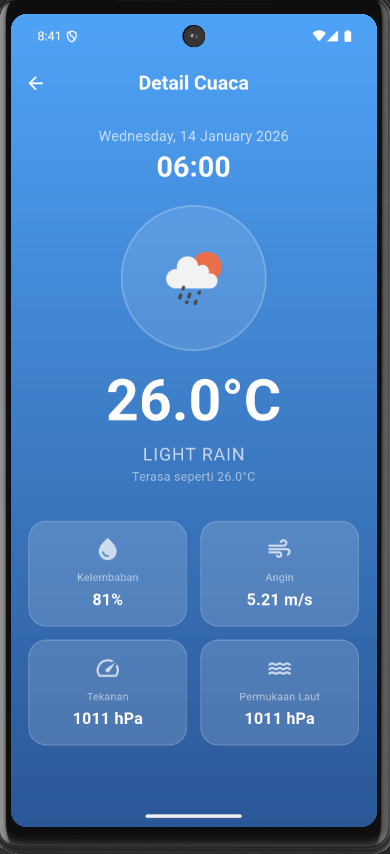

# 🌤️ Weather App (Cuaca Raffi)

Aplikasi cuaca berbasis mobile yang dibangun menggunakan **Flutter** dengan tampilan antarmuka modern (*Glassmorphism*) dan didukung oleh Backend **Node.js (Express)**.

Aplikasi ini menampilkan cuaca real-time, ramalan cuaca 5 hari ke depan, dan detail cuaca (kelembaban, angin, tekanan) menggunakan data dari OpenWeatherMap.

---

## 📸 Preview

<div align="center">
  
  
  
</div>

<div align="center">
  
</div>


---

## 📱 Fitur Utama

- **Real-time Weather:** Menampilkan suhu dan cuaca terkini
- **Search City:** Fitur pencarian untuk mengecek cuaca di kota mana pun di dunia
- **5-Day Forecast:** Melihat ramalan cuaca per 3 jam untuk 5 hari ke depan
- **Interactive Details:** Klik pada daftar ramalan untuk melihat detail lengkap (angin, kelembaban, dll)


---

## 🛠️ Teknologi yang Digunakan

### Frontend (Mobile)
- Flutter (Dart)
- State Management: `setState` (Native)
- Library: `http`, `intl`

### Backend (API Service)
- Node.js & Express.js
- Axios (Request ke OpenWeatherMap)
- Cors & Dotenv

---

## 🚀 Cara Menjalankan Aplikasi

Ikuti langkah-langkah ini untuk menjalankan proyek di komputer lokal Anda.

### 1️⃣ Persiapan Backend (Server)

Karena API Key disembunyikan untuk keamanan, Anda perlu menyetting backend terlebih dahulu.

#### Langkah-langkah:

1. **Install dependencies:**
```bash
   cd backend
   npm install
```

2. **Buat file `.env`:**
   
   Buat file baru bernama `.env` di folder backend, lalu isi dengan konfigurasi berikut:
```env
   API_KEY=MASUKKAN_API_KEY_OPENWEATHERMAP_DISINI
   PORT=3001
```
   
   > **Catatan:** Anda bisa mendapatkan API Key gratis di [openweathermap.org](https://openweathermap.org)

3. **Jalankan server:**
```bash
   node index.js
```
   
   Pastikan terminal menampilkan: `Backend jalan di http://localhost:3001`

---

### 2️⃣ Persiapan Frontend (Flutter)

#### Langkah-langkah:

1. **Buka terminal baru** dan pastikan berada di folder project Flutter

2. **Install dependencies:**
```bash
   flutter pub get
```

3. **Pastikan Emulator Android sudah berjalan**
   - Disarankan menggunakan API 33/34

4. **Jalankan aplikasi:**
```bash
   flutter run
```

---

## 📋 Prasyarat

Sebelum menjalankan aplikasi, pastikan Anda telah menginstal:

- **Flutter SDK** (versi 3.0 atau lebih baru)
- **Node.js** (versi 14 atau lebih baru)
- **npm** atau **yarn**
- **Android Studio** dengan emulator atau perangkat fisik untuk testing

---

## 📂 Struktur Folder
```
weather-app/
├── backend/
│   ├── index.js
│   ├── package.json
│   └── .env
├── lib/
│   ├── main.dart
│   └── ...
├── screenshots/         
│   ├── home.png
│   ├── search.png
│   ├── forecast.png
│   ├── details.png
│
├── pubspec.yaml
└── README.md
```

---

## 🔑 Mendapatkan API Key OpenWeatherMap

1. Kunjungi [OpenWeatherMap](https://openweathermap.org/)
2. Buat akun gratis
3. Navigasi ke bagian **API Keys**
4. Copy API Key Anda
5. Paste ke file `.env` di backend

---

## 🐛 Troubleshooting

### Backend tidak jalan
- Pastikan port 3001 tidak digunakan aplikasi lain
- Cek apakah file `.env` sudah dibuat dengan benar
- Verifikasi API Key valid

### Flutter error saat run
- Jalankan `flutter clean` kemudian `flutter pub get`
- Pastikan emulator sudah running
- Cek koneksi internet untuk download dependencies

---


## 📝 Lisensi

[MIT License](LICENSE)

---

## 👤 Author

**Raffi**

- GitHub: [@username](https://github.com/Rafreaks06)
- Email: email@example.com

---

## 🙏 Acknowledgments

- [OpenWeatherMap API](https://openweathermap.org/) untuk data cuaca
- Flutter Community
- Node.js Community

---

## ⭐ Support

Jika proyek ini bermanfaat, jangan lupa berikan ⭐ di repository ini!