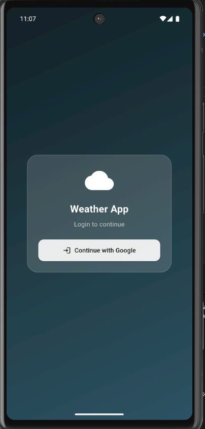
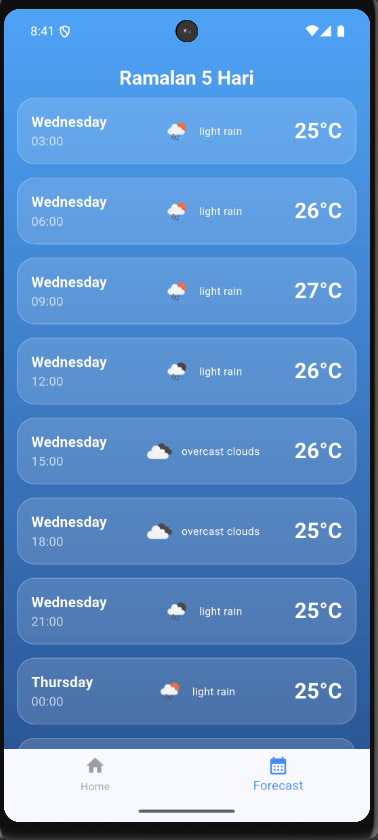

# 🌤️ Cuaca Raffi - Weather App

Aplikasi cuaca berbasis mobile yang dibangun menggunakan **Flutter** dengan desain modern **Glassmorphism**. Dilengkapi dengan autentikasi **Google OAuth** melalui Supabase dan backend Node.js untuk keamanan API key.

## ✨ Fitur

- 🌡️ **Real-time Weather** - Menampilkan suhu dan kondisi cuaca terkini
- 🔍 **Search City** - Cari cuaca di berbagai kota di seluruh dunia
- 📅 **5-Day Forecast** - Ramalan cuaca 5 hari ke depan
- 💨 **Weather Details** - Informasi detail kelembaban, kecepatan angin, dan tekanan udara
- 🔐 **Google Authentication** - Login mudah dan aman menggunakan akun Google
- 💾 **Session Persistence** - Tetap login meskipun aplikasi ditutup
- 🎨 **Modern UI** - Desain glassmorphism yang elegan
- 🔒 **Secure API** - API key tersimpan aman di backend

## 📸 Screenshots

<div align="center">
  
  
  
  
</div>

## 🛠️ Tech Stack

### Frontend (Mobile)
- **Flutter** (Dart)
- **Supabase Flutter SDK** - Authentication
- **State Management** - setState (Native)
- **Dependencies**:
  - `http` - HTTP requests
  - `intl` - Internationalization
  - `flutter_dotenv` - Environment variables
  - `supabase_flutter` - Supabase integration

### Backend (API Service)
- **Node.js** & **Express.js**
- **Axios** - HTTP client
- **CORS** - Cross-Origin Resource Sharing
- **Dotenv** - Environment configuration

### External Services
- **OpenWeatherMap API** - Weather data
- **Supabase Auth** - Google OAuth authentication

## 📋 Prerequisites

Sebelum memulai, pastikan Anda telah menginstal:

- ✅ [Flutter SDK](https://flutter.dev/docs/get-started/install) (>= 3.x)
- ✅ [Node.js](https://nodejs.org/) (>= 14.x)
- ✅ [Android Studio](https://developer.android.com/studio) atau VS Code
- ✅ Emulator Android atau device fisik
- ✅ Akun [Supabase](https://supabase.com)
- ✅ Akun [Google Developer Console](https://console.developers.google.com)
- ✅ API Key dari [OpenWeatherMap](https://openweathermap.org/api)

## 🚀 Installation & Setup

### 1️⃣ Clone Repository

```bash
git clone https://github.com/Rafreaks06/weather-app.git
cd weather-app
```

### 2️⃣ Setup Backend

#### Install Dependencies

```bash
cd backend
npm install
```

#### Configure Environment Variables

Buat file `.env` di folder `backend/`:

```env
API_KEY=your_openweathermap_api_key
PORT=3001
```

> ⚠️ **Penting**: Dapatkan API key dari [OpenWeatherMap](https://openweathermap.org/api)

#### Run Backend Server

```bash
node index.js
```

Jika berhasil, akan muncul:
```
Backend jalan di http://localhost:3001
```

### 3️⃣ Setup Supabase

#### Create Project

1. Buka [Supabase Dashboard](https://supabase.com)
2. Klik **New Project**
3. Isi detail project dan tunggu hingga selesai

#### Enable Google OAuth

1. Masuk ke **Authentication** → **Providers**
2. Aktifkan **Google**
3. Isi credential dari [Google Console](https://console.developers.google.com):
   - **Client ID**
   - **Client Secret**
4. Tambahkan **Authorized Redirect URI**:
   ```
   io.supabase.flutter://login-callback
   ```

#### Get Supabase Credentials

1. Buka **Settings** → **API**
2. Copy:
   - **Project URL**
   - **anon/public key**

### 4️⃣ Setup Flutter App

#### Install Dependencies

```bash
cd ../weather_app  # atau sesuai nama folder Flutter Anda
flutter pub get
```

#### Configure Environment Variables

Buat file `.env` di root folder Flutter:

```env
SUPABASE_URL=https://your-project.supabase.co
SUPABASE_ANON_KEY=your_anon_key_here
```

> ⚠️ **Catatan**: 
> - Jangan gunakan tanda petik
> - Jangan ada spasi
> - Pastikan tidak ada koma di akhir

#### Update pubspec.yaml

Pastikan file `.env` ditambahkan ke assets:

```yaml
flutter:
  uses-material-design: true
  assets:
    - .env
```

#### Run Application

```bash
flutter clean
flutter pub get
flutter run
```

Pilih device/emulator yang ingin digunakan.

## 📂 Project Structure

```
weather_app/
├── backend/
│   ├── index.js           # Express server
│   ├── package.json       # Node dependencies
│   └── .env              # Backend environment variables
│
├── lib/
│   ├── pages/
│   │   ├── login_page.dart     # Login screen
│   │   ├── home_page.dart      # Main weather screen
│   │   └── forecast_page.dart  # 5-day forecast
│   │
│   ├── services/
│   │   ├── auth_service.dart    # Supabase authentication
│   │   └── weather_service.dart # Weather API calls
│   │
│   └── main.dart          # App entry point
│
├── screenshots/          # App screenshots
├── .env                 # Flutter environment variables
├── pubspec.yaml        # Flutter dependencies
└── README.md          # This file
```

## 🔐 Authentication Flow

```
1. User clicks "Continue with Google"
2. Redirect to Google login page
3. User authenticates with Google
4. Redirect back to app with auth token
5. Session saved automatically by Supabase
6. User redirected to Home page
```

## 🐛 Troubleshooting

### ❌ Error: `.env` file not found

**Solusi:**
- Pastikan file `.env` ada di root folder Flutter
- Sudah ditambahkan di `pubspec.yaml` → `assets`
- Jalankan `flutter clean` dan `flutter pub get`

### ❌ Login loop / redirect ke login terus

**Solusi:**
- Periksa Redirect URL di Supabase: `io.supabase.flutter://login-callback`
- Pastikan `AuthGate` atau `StreamBuilder` sudah benar
- Cek apakah Supabase initialize berhasil di `main.dart`

### ❌ Data cuaca tidak muncul

**Solusi:**
- Pastikan backend berjalan di `http://localhost:3001`
- Cek API key OpenWeatherMap valid
- Pastikan koneksi internet aktif
- Cek log di terminal untuk error message

### ❌ Build error di Android

**Solusi:**
```bash
flutter clean
cd android
./gradlew clean
cd ..
flutter pub get
flutter run
```

## 🔄 API Endpoints

### Backend Endpoints

```
GET /api/weather?city={cityName}
```
Response:
```json
{
  "name": "Jakarta",
  "main": {
    "temp": 30.5,
    "humidity": 70,
    "pressure": 1013
  },
  "weather": [
    {
      "main": "Clouds",
      "description": "broken clouds"
    }
  ],
  "wind": {
    "speed": 3.5
  }
}
```

## 📝 Environment Variables

### Backend (.env)
```env
API_KEY=your_openweathermap_api_key
PORT=3001
```

### Flutter (.env)
```env
SUPABASE_URL=https://xxxxx.supabase.co
SUPABASE_ANON_KEY=eyJhbGciOi...
```

## 🤝 Contributing

Kontribusi selalu diterima! Jika Anda ingin berkontribusi:

1. Fork repository ini
2. Buat branch baru (`git checkout -b feature/AmazingFeature`)
3. Commit perubahan (`git commit -m 'Add some AmazingFeature'`)
4. Push ke branch (`git push origin feature/AmazingFeature`)
5. Buat Pull Request

## 📄 License

Distributed under the MIT License. See `LICENSE` for more information.

## 👤 Author

**Raffi**

- GitHub: [@Rafreaks06](https://github.com/Rafreaks06)
- Email: mr.rafreaks@gmail.com

---

## 🙏 Acknowledgments

- [OpenWeatherMap](https://openweathermap.org/) - Weather data API
- [Supabase](https://supabase.com/) - Backend as a Service
- [Flutter](https://flutter.dev/) - UI framework
- [Node.js](https://nodejs.org/) - Backend runtime

## ⭐ Show Your Support

Jika proyek ini bermanfaat, jangan lupa berikan ⭐ di repository ini!
